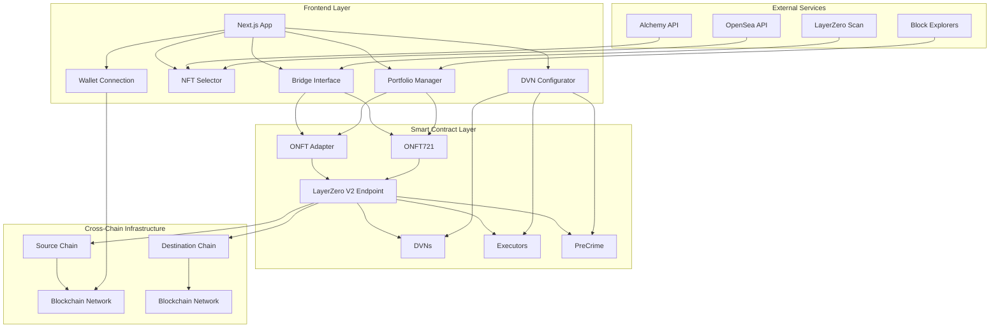
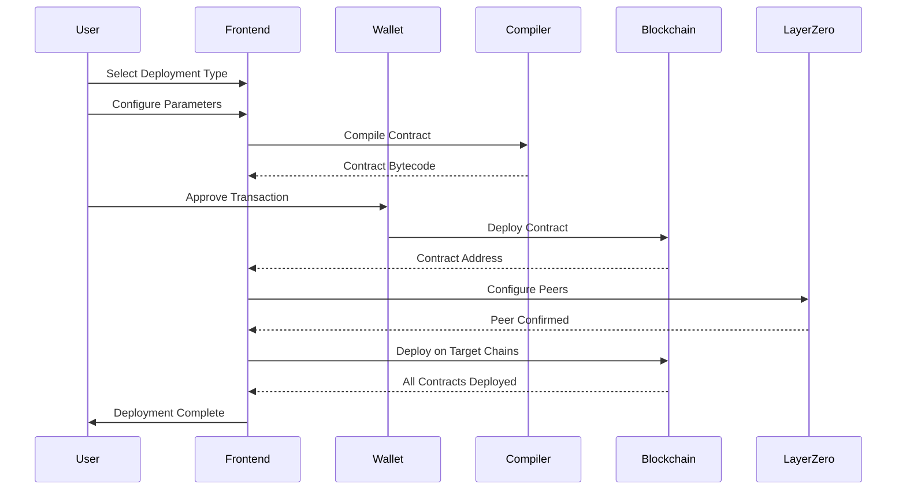
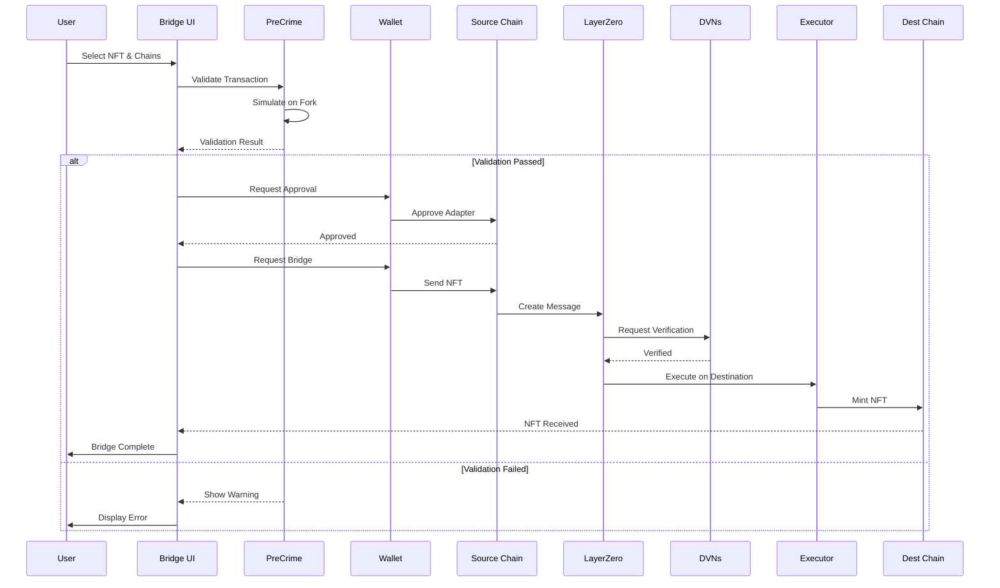
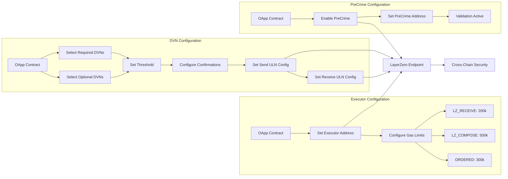
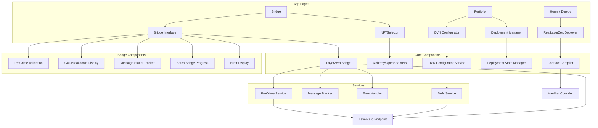
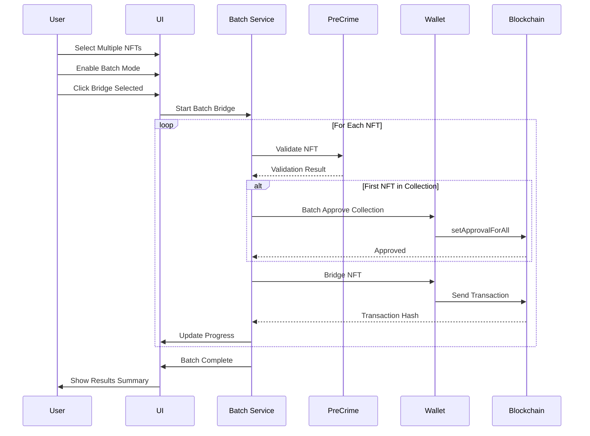

# 0NFT Deployer - Cross-Chain NFT Platform

A comprehensive platform for deploying, managing, and bridging Omnichain Non-Fungible Tokens (ONFTs) using LayerZero V2 infrastructure. This application enables users to make existing NFT collections omnichain-compatible, create new cross-chain NFT collections, and seamlessly bridge NFTs between chains.

   

## 🌟 Core Features

### 🔗 ONFT Adapter Deployment
- **Existing Collection Integration**: Make any ERC721 collection omnichain-compatible without modifying the original contract
- **Lock & Mint Mechanism**: Tokens are locked on source chain, minted/unlocked on destination chains
- **Contract Validation**: Automatic ERC721 compliance checking with detailed analysis
- **Multi-Chain Support**: Deploy adapters across 22+ supported chains simultaneously
- **Real LayerZero V2**: Uses official LayerZero V2 contracts with Hardhat compilation
- **Gas Optimization**: Smart gas estimation with fallback mechanisms
- **Automatic Peer Configuration**: Seamless cross-chain contract connections

### 🎨 New ONFT Collection Deployment
- **Burn & Mint Mechanism**: Native omnichain NFTs with burn/mint cross-chain transfers
- **Customizable Parameters**: 
  - Collection name and symbol
  - Maximum supply configuration
  - Base URI for metadata
  - Mint price (can be free)
  - Per-address mint limits
- **Built-in Minting**: Integrated minting functionality with configurable limits
- **Owner Controls**: Administrative functions for collection management
- **Multi-Chain Deployment**: Deploy the same collection across multiple chains

### 🌉 Cross-Chain NFT Bridging
- **Intuitive Bridge Interface**: Simple, user-friendly bridging experience
- **Multi-Chain NFT Browser**: Browse NFTs from all supported chains or filter by specific chain
- **Automatic Contract Selection**: Smart detection of adapter vs. direct ONFT contracts
- **Real-time Status Tracking**: Live updates on bridge transaction status
- **LayerZero GUID Tracking**: Monitor cross-chain message delivery
- **Gas Fee Estimation**: Accurate cost estimates before bridging
- **Error Handling**: Comprehensive error messages and recovery suggestions
- **Batch Bridging**: Bridge multiple NFTs in one operation with progress tracking
- **PreCrime Validation**: Transaction simulation before execution to prevent failed transactions

### 📊 Portfolio Management
- **Deployment Overview**: View all your deployed contracts across chains
- **Contract Details**: 
  - Contract addresses per chain
  - Deployment timestamps
  - Verification status
  - Transaction links to block explorers
- **Peer Configuration**: Set up and manage cross-chain connections
- **BaseURI Management**: Set metadata URIs for ONFT contracts (supports on-chain hybrid NFTs)
- **Progress Tracking**: Real-time deployment progress with step-by-step status
- **Multi-Deployment Support**: Manage multiple deployments simultaneously
- **DVN Security Configuration**: Configure Decentralized Verifier Networks for both directions (source → destination and destination → source)
- **Executor & Gas Settings**: Configure executor options and gas limits per message type
- **Deployment State Export/Import**: Export and import deployment configurations as JSON

### 🖼️ Advanced NFT Features
- **Multi-Chain NFT Selector**: 
  - Browse NFTs from a single chain or all chains simultaneously
  - Chain filtering and search functionality
  - Grouped display by chain
  - Supports NFTs from any source (IPFS, HTTP, on-chain hybrid)
- **On-Chain Hybrid NFT Support**: 
  - Handles NFTs with RLE-encoded pixel data in transactions
  - Automatic metadata URI extraction and configuration
  - Cross-chain metadata compatibility
- **Image Loading**: Robust image handling with fallbacks for any domain

### ⛓️ Cross-Chain Infrastructure
- **LayerZero V2 Integration**: Latest LayerZero protocol for secure cross-chain messaging
- **Official Contract Addresses**: Integrated official LayerZero V2 contract addresses from official documentation
  - EndpointV2, SendUln302, ReceiveUln302, ReadLib1002, LZ Executors, and more
  - Source: https://docs.layerzero.network/v2/deployments/deployed-contracts
- **22+ Supported EVM Chains**: 
  - **Mainnets**: Ethereum, Polygon, Arbitrum, Optimism, Base, Avalanche, BNB Chain, Fantom, Arbitrum Nova, Aurora, Celo, Cronos, Moonbeam, Moonriver, Metis, Polygon zkEVM, zkSync Era, Linea, Mantle, Scroll
  - **Testnets**: Sepolia, Polygon Amoy, Arbitrum Sepolia, Optimism Sepolia, Base Sepolia, Avalanche Fuji, BNB Testnet, Fantom Testnet, and more
- **Non-EVM Chains** (Planned):
  - **Solana**: OFT support planned (see `docs/SOLANA_INTEGRATION_PLAN.md`)
  - **Aptos**: Integration planned for future
  - **Sui**: Integration planned for future
- **Automatic Peer Setup**: Seamless cross-chain contract connections
- **Endpoint Configuration**: Automatic LayerZero V2 endpoint detection and configuration
- **DVN Configuration**: Configure Decentralized Verifier Networks (DVNs) for enhanced security
- **Executor Options**: Configure executor settings for destination chain gas payment with official executor addresses
- **PreCrime Integration**: Transaction validation before execution to prevent failures

### 🔧 Development & Compilation
- **Hardhat Integration**: Full Hardhat compilation support for real LayerZero contracts
- **Hybrid Compilation System**: 
  - Primary: Hardhat compilation with real LayerZero source
  - Fallback: Backend compilation API
  - Final fallback: Browser-based compilation
- **Contract Verification**: Automatic contract verification on block explorers (Etherscan, Basescan, etc.)
- **Type Safety**: Full TypeScript support with generated typechain types
- **Contract Analysis**: Pre-deployment contract validation and ERC721 compliance checking

### 🎯 User Experience
- **Intuitive Interface**: Clean, modern UI built with shadcn/ui components
- **Wallet Integration**: RainbowKit/Wagmi for seamless wallet connections
  - MetaMask support
  - WalletConnect support
  - Multiple wallet options
- **Real-time Progress**: Live deployment tracking with detailed status updates
- **Cost Estimation**: Gas fee estimates across all deployment chains
- **Error Recovery**: Comprehensive error handling with actionable suggestions
- **Responsive Design**: Works seamlessly on desktop and mobile devices

## 🚀 Quick Start

### Prerequisites
- Node.js 18+ and npm
- A Web3 wallet (MetaMask, WalletConnect, etc.)
- Testnet ETH for deployments (or mainnet ETH for production)

### Installation

1. **Clone the repository**
   ```bash
   git clone https://github.com/your-username/0nft-deployer.git
   cd 0nft-deployer
   ```

2. **Install dependencies**
   ```bash
   npm install
   ```

3. **Set up environment variables**
   ```bash
   cp .env.example .env.local
   ```
   
   Add your configuration:
   ```env
   NEXT_PUBLIC_WALLETCONNECT_PROJECT_ID=your_walletconnect_project_id
   NEXT_PUBLIC_ALCHEMY_API_KEY=your_alchemy_api_key
   NEXT_PUBLIC_OPENSEA_API_KEY=your_opensea_api_key
   ETHERSCAN_API_KEY=your_etherscan_api_key
   BASESCAN_API_KEY=your_basescan_api_key
   ```

4. **Start the development server**
   ```bash
   npm run dev
   ```

5. **Open your browser**
   Navigate to `http://localhost:3000`

## 📋 Usage Guide

### Deploying an ONFT Adapter

1. **Navigate to Home Page**: The main deployment interface
2. **Connect Your Wallet**: Click "Connect Wallet" in the top-right corner
3. **Select "ONFT Adapter" Tab**: Choose the adapter deployment option
4. **Configure Source Chain**: Select the chain where your existing NFT collection is deployed
5. **Enter Contract Address**: Provide the address of your existing ERC721 contract
6. **Analyze Contract** (Optional): Click "Analyze Contract" to verify ERC721 compliance
7. **Select Target Chains**: Choose which chains you want to make your NFTs available on
8. **Review & Deploy**: Confirm the configuration and start deployment
9. **Monitor Progress**: Watch real-time deployment progress across all chains
10. **Configure Peers**: After deployment, set up cross-chain connections in the Portfolio

### Creating a New ONFT Collection

1. **Navigate to Home Page**: The main deployment interface
2. **Connect Your Wallet**: Ensure your wallet is connected
3. **Select "New ONFT Collection" Tab**: Choose the new collection option
4. **Configure Collection**:
   - Collection name and symbol
   - Maximum supply
   - Base URI for metadata (optional, can be set later)
   - Mint price (can be 0 for free mint)
   - Maximum mints per address
5. **Select Deployment Chains**: Choose which chains to deploy on
6. **Review & Deploy**: Confirm settings and initiate deployment
7. **Set BaseURI** (if needed): Use the Portfolio page to set metadata URIs after deployment

### Bridging NFTs Between Chains

1. **Navigate to Bridge Page**: Click "Bridge" in the navigation
2. **Connect Your Wallet**: Ensure your wallet is connected
3. **Select Source Chain**: Choose the chain where your NFT currently exists
4. **Select Destination Chain**: Choose where you want to bridge the NFT
5. **Choose Bridge Mode**:
   - **Single NFT**: Select one NFT to bridge
   - **Batch Mode**: Enable batch mode to bridge multiple NFTs at once
6. **Browse Your NFTs**: 
   - Click "Browse Your NFTs" to open the NFT selector
   - Choose to view NFTs from a specific chain or all chains
   - Select NFT(s) you want to bridge (check boxes in batch mode)
7. **Enter Contract Address**: The bridge contract address is auto-detected based on source/destination
8. **PreCrime Validation** (if enabled): Transaction will be validated before execution
9. **Review & Bridge**: Confirm details and initiate the bridge transaction
10. **Monitor Status**: 
    - Track the bridge progress with LayerZero GUID
    - View gas breakdown and fee details
    - Monitor message delivery status in real-time

### Managing Your Portfolio

1. **Navigate to Portfolio Page**: Click "Portfolio" in the navigation
2. **View Deployments**: See all your deployed contracts organized by deployment
3. **Contract Details**: 
   - View contract addresses on each chain
   - Check verification status
   - Access block explorer links
4. **Configure Peers**: Set up cross-chain connections between your contracts
5. **Set BaseURI**: Configure metadata URIs for ONFT contracts
6. **Refresh Metadata**: Update OpenSea metadata if needed

### NFT Browser Features

1. **Chain Selection**: 
   - Use the dropdown to select a specific chain
   - Or choose "All Chains" to see NFTs from all supported chains
2. **Search Functionality**: Search by name, collection, token ID, or chain
3. **Grouped Display**: When viewing all chains, NFTs are grouped by chain
4. **Image Loading**: Images load from any source (IPFS, HTTP, on-chain)

## 🏗️ Architecture

### System Architecture Overview



### Deployment Flow



### Bridge Flow with PreCrime



### DVN & Security Configuration



### Component Structure



### Batch Bridging Flow



### Frontend Stack
- **Next.js 14**: React framework with App Router
- **TypeScript**: Type-safe development
- **Tailwind CSS**: Utility-first styling
- **shadcn/ui**: Modern, accessible UI components
- **Wagmi**: React hooks for Ethereum
- **RainbowKit**: Wallet connection library
- **Ethers.js**: Ethereum interaction library

### Smart Contracts
- **LayerZero V2**: Cross-chain messaging protocol
- **ONFT721**: Official LayerZero ONFT implementation
- **ONFT721Adapter**: Official LayerZero adapter implementation
- **OpenZeppelin**: Secure contract standards (Ownable, ERC721, etc.)
- **Custom Contracts**: Enhanced implementations with additional features

### Compilation System
- **Hardhat**: Primary compilation engine
- **Backend API**: Fallback compilation endpoint
- **Browser Compiler**: Final fallback for client-side compilation
- **Contract Flattening**: Automatic contract flattening for verification

### Supported Chains

#### Mainnets
- Ethereum, Polygon, Arbitrum, Optimism, Base
- Avalanche, BNB Chain, Fantom
- Arbitrum Nova, Aurora, Celo, Cronos
- Moonbeam, Moonriver, Metis
- Polygon zkEVM, zkSync Era, Linea, Mantle, Scroll

#### Testnets
- Sepolia, Polygon Amoy, Arbitrum Sepolia
- Optimism Sepolia, Base Sepolia
- Avalanche Fuji, BNB Testnet, Fantom Testnet
- And more...

## 🛠️ Development

### Project Structure
```
src/
├── app/                    # Next.js app router pages
│   ├── page.tsx           # Home/Deploy page
│   ├── bridge/            # Bridge page
│   ├── portfolio/         # Portfolio management page
│   └── layout.tsx         # Root layout
├── components/             # React components
│   ├── ui/                # shadcn/ui components
│   ├── real-layerzero-deployer.tsx  # Main deployment component
│   ├── nft-selector.tsx   # Multi-chain NFT browser
│   ├── peer-configurator.tsx  # Cross-chain peer setup
│   ├── auto-verify-modal.tsx  # Contract verification
│   ├── dvn-configurator.tsx  # DVN and executor configuration UI
│   ├── precrime-validation-display.tsx  # PreCrime validation results
│   ├── batch-bridge-progress.tsx  # Batch bridging progress tracker
│   ├── gas-breakdown-display.tsx  # Gas fee breakdown display
│   ├── message-status-display.tsx  # LayerZero message status
│   ├── error-display.tsx  # Error handling UI
│   └── ...                # Other components
├── lib/                    # Utility libraries
│   ├── chains.ts          # Chain configurations
│   ├── contract-compiler.ts  # Hybrid compilation system
│   ├── layerzero-bridge.ts  # Bridge functionality
│   ├── deployment-state-manager.ts  # Portfolio state
│   ├── dvn-configurator.ts  # DVN and executor configuration
│   ├── precrime-service.ts  # PreCrime validation service
│   ├── layerzero-message-tracker.ts  # Message status tracking
│   ├── layerzero-errors.ts  # Error handling and recovery
│   └── ...                # Other utilities
├── hooks/                  # Custom React hooks
└── styles/                 # Global styles

contracts/                  # Solidity contracts
├── ONFT.sol               # Custom ONFT implementation
├── ONFTAdapter.sol        # Custom Adapter implementation
└── ...                    # Other contracts

pages/api/                  # API routes
├── compile-with-hardhat.js  # Hardhat compilation endpoint
└── ...                    # Other API endpoints
```

### Key Components

- **`RealLayerZeroDeployer`**: Main deployment component with multi-chain support
- **`NFTSelector`**: Multi-chain NFT browser with search and filtering
- **`PeerConfigurator`**: Cross-chain peer connection setup
- **`AutoVerifyModal`**: Automatic contract verification on block explorers
- **`ChainSelector`**: Multi-chain selection with logos and metadata
- **`ContractAnalyzer`**: ERC721 contract validation and analysis
- **`DeploymentStateManager`**: Portfolio state persistence
- **`DvnConfigurator`**: DVN and executor configuration interface
- **`PreCrimeValidationDisplay`**: PreCrime validation results display
- **`BatchBridgeProgressDisplay`**: Real-time batch bridging progress tracker
- **`GasBreakdownDisplay`**: Detailed gas and fee breakdown visualization
- **`MessageStatusDisplay`**: LayerZero message delivery status tracker
- **`ErrorDisplay`**: Comprehensive error handling and recovery UI

### Adding New Chains

1. Add chain configuration to `src/lib/chains.ts`:
   ```typescript
   {
     ...chainFromWagmi,
     layerZeroEndpointId: 30XXX, // LayerZero EID
     layerZeroEndpointV2: '0x1a44076050125825900e736c501f859c50fE728c', // V2 endpoint
     isTestnet: false,
     logo: '/chains/chain-name.svg',
     description: 'Chain description'
   }
   ```

2. Add RPC configuration to `src/lib/wagmi.ts`
3. Update chain logo mapping in `src/components/ui/chain-logo.tsx`
4. Add block explorer API key to environment variables if needed

## 🧪 Testing

### Running Tests
```bash
# Run all tests
npm test

# Run tests in watch mode
npm run test:watch

# Run contract tests
npm run test:contracts
```

### Manual Testing Checklist

- [ ] Wallet connection works across different wallets
- [ ] Chain selection displays correct logos and information
- [ ] Contract analysis validates ERC721 contracts correctly
- [ ] ONFT Adapter deployment completes successfully
- [ ] New ONFT deployment works with custom parameters
- [ ] Cross-chain peer setup functions properly
- [ ] Contract verification succeeds on block explorers
- [ ] NFT bridging works between chains
- [ ] Multi-chain NFT browser displays NFTs correctly
- [ ] Portfolio page shows all deployments
- [ ] BaseURI setting works for metadata
- [ ] Error handling displays appropriate messages

## 🔒 Security Considerations

- **Contract Audits**: All contracts should be audited before mainnet deployment
- **Private Key Management**: Never commit private keys or mnemonics
- **RPC Endpoints**: Use secure, rate-limited RPC providers
- **Input Validation**: All user inputs are validated and sanitized
- **Error Handling**: Comprehensive error handling prevents crashes
- **Access Controls**: Proper owner/admin controls on deployed contracts
- **Gas Limits**: Proper gas estimation prevents failed transactions
- **Network Validation**: Automatic network switching and validation

## 📱 Pages & Features

### Home Page (`/`)
- **ONFT Adapter Deployment**: Deploy adapters for existing NFT collections
- **New ONFT Deployment**: Create new cross-chain NFT collections
- **Contract Analysis**: Validate ERC721 contracts before deployment
- **Multi-Chain Selection**: Choose source and target chains
- **Real-time Deployment**: Track deployment progress across chains

### Bridge Page (`/bridge`)
- **Cross-Chain Bridging**: Transfer NFTs between chains
- **Multi-Chain NFT Browser**: Browse NFTs from all chains
- **Automatic Contract Detection**: Smart adapter/ONFT selection
- **Transaction Tracking**: Monitor bridge status with LayerZero GUID
- **Gas Estimation**: Accurate cost estimates
- **Batch Bridging**: Bridge multiple NFTs in one operation with real-time progress tracking
- **PreCrime Validation**: Automatic transaction simulation before execution
- **Gas Breakdown Display**: Detailed fee breakdown (source gas, DVN fees, executor fees, destination gas)
- **Message Status Tracking**: Real-time LayerZero message delivery status

### Portfolio Page (`/portfolio`)
- **Deployment Overview**: View all deployed contracts
- **Contract Management**: Access contract details and explorer links
- **Peer Configuration**: Set up cross-chain connections
- **BaseURI Management**: Configure metadata URIs
- **Verification Status**: Check contract verification status
- **Deployment History**: Track all deployment activities
- **DVN Configuration**: Configure Decentralized Verifier Networks for enhanced security
- **Executor Options**: Configure executor settings and gas limits
- **PreCrime Settings**: Enable/configure PreCrime validation for transactions
- **Deployment Export/Import**: Export and import deployment states as JSON

### Query Page (`/query`) - Cross-Chain Queries (lzRead)
- **Cross-Chain State Queries**: Query contract state from other chains using LayerZero Read
- **Request-Response Pattern**: Pull data from remote blockchains without deploying contracts
- **Flexible Query Interface**: Query any public function on any supported chain
- **Fee Estimation**: Get cost estimates before executing queries
- **Real-Time Data**: Retrieve current state data from other chains
- **OApp Integration**: Use deployed OApp Read contracts or enter custom addresses

#### Practical Use Cases:
- **Cross-Chain NFT Ownership Verification**: Check if a user owns specific NFTs on other chains
- **Cross-Chain Balance Checks**: Query token balances across chains
- **Cross-Chain Contract State**: Read any contract state from remote chains
- **Omnichain Whitelisting** (Future Enhancement): Verify whitelist status across multiple chains
  - Check if user is whitelisted on Ethereum from Base
  - Aggregate whitelist status from multiple chains
  - Verify eligibility based on cross-chain holdings
  - Enable minting on one chain based on whitelist status from another
  - Example: User whitelisted on Ethereum → Can mint on Base without separate whitelist

### OApp Configuration Page (`/oapp-config`)
- **Centralized Configuration**: Manage all OApp settings in one place
- **DVN Management**: Configure Decentralized Verifier Networks
- **Executor Settings**: Set executor options and gas limits
- **PreCrime Configuration**: Enable and configure PreCrime validation
- **Delegate Management**: Manage authorized delegate addresses
- **Path Options**: Configure message options per chain pair

### Deployment Features
- **Deterministic Deployments (CREATE2)**: Deploy contracts at predictable addresses
  - Address prediction before deployment
  - Salt-based deployment control
  - Address verification and availability checking
  - CREATE2 factory integration
  - Automatic fallback to standard deployment

## 🤝 Contributing

We welcome contributions! Please see our [Contributing Guide](CONTRIBUTING.md) for details.

### Development Workflow

1. Fork the repository
2. Create a feature branch: `git checkout -b feature/amazing-feature`
3. Make your changes and add tests
4. Commit your changes: `git commit -m 'Add amazing feature'`
5. Push to the branch: `git push origin feature/amazing-feature`
6. Open a Pull Request

## 📄 License

This project is licensed under the MIT License - see the [LICENSE](LICENSE) file for details.

## 🆘 Support

- **Documentation**: [LayerZero V2 Docs](https://docs.layerzero.network/v2)
- **Discord**: Join our [Discord community](https://discord.gg/layerzero)
- **Issues**: Report bugs on [GitHub Issues](https://github.com/your-username/0nft-deployer/issues)
- **Email**: Contact us at support@0nft-deployer.com

## 🙏 Acknowledgments

- [LayerZero Labs](https://layerzero.network/) for the omnichain infrastructure
- [OpenZeppelin](https://openzeppelin.com/) for secure contract standards
- [shadcn/ui](https://ui.shadcn.com/) for the beautiful UI components
- [Wagmi](https://wagmi.sh/) and [RainbowKit](https://rainbowkit.com/) for Web3 integration

## 🎯 Recent Updates

### Latest Features (2024)

#### ✅ Deterministic Deployments (CREATE2) - NEW!
- **Predictable Contract Addresses**: Calculate contract addresses before deployment
- **CREATE2 Factory Integration**: Deploy contracts at deterministic addresses using CREATE2 opcode
- **Salt Management**: Custom or auto-generated salts for address control
- **Address Verification**: Check address availability before deployment
- **Multi-Chain Support**: Works across all supported chains
- **Automatic Fallback**: Falls back to standard deployment if CREATE2 fails

#### ✅ OApp Configuration Management
- **Dedicated Configuration Page**: Centralized OApp settings management (`/oapp-config`)
- **DVN Management**: Configure Decentralized Verifier Networks
- **Executor Settings**: Set executor options and gas limits
- **PreCrime Configuration**: Enable and configure PreCrime validation
- **Delegate Management**: Manage authorized delegate addresses
- **Path Options**: Configure message options per chain pair

#### ✅ Cross-Chain Queries (lzRead)
- **Omnichain Queries**: Query contract state from other chains without deploying contracts
- **Request-Response Pattern**: Pull data from remote blockchains
- **Flexible Query Interface**: Query any public function on any supported chain
- **Fee Estimation**: Get cost estimates before executing queries
- **OApp Read Integration**: Use deployed OApp Read contracts or custom addresses

#### ✅ PreCrime Integration
- **Transaction Validation**: Simulate transactions before execution to prevent failures
- **PreCrime Validation Service**: Simulation support with validation results
- **PreCrime Configuration UI**: Configure in DVN configurator
- **Real-time Validation Display**: Show validation status in bridge UI
- **Batch Operation Support**: PreCrime validation for batch bridging

#### ✅ Batch Bridging
- **Multi-Select Interface**: Select multiple NFTs for bridging
- **Real-time Progress Tracking**: Track progress per NFT with status updates
- **Batch Approval Optimization**: Optimize gas by grouping approvals
- **Aggregated Gas Breakdown**: Total cost breakdown for batch operations

#### ✅ Message Retry and Recovery
- **Automatic Retry System**: Detect failed messages and retry with adjusted gas
- **Manual Retry Interface**: User-triggered retry for stuck messages
- **Retry History Tracking**: Track all retry attempts with timestamps
- **Recovery Tools**: Tools for recovering stuck messages

#### ✅ DVN Configuration
- **Enhanced Security**: Decentralized Verifier Networks for message verification
- **Required and Optional DVNs**: Select DVNs with threshold configuration
- **Bidirectional Setup**: Configure DVNs for both directions (source ↔ destination)
- **Configuration Status Indicators**: Visual indicators for configured DVNs

#### ✅ Executor Options & Gas Settings
- **Advanced Executor Configuration**: Configure executor options and gas limits
- **Message Type Support**: LZ_RECEIVE, LZ_COMPOSE, ORDERED options
- **Executor Address Auto-Detection**: Automatic executor address fetching
- **Gas Breakdown Display**: Detailed fee breakdown (source, DVN, executor, destination)
- **Single-Transaction Bridging**: Users only pay on source chain when executor is available

#### ✅ Message Status Tracking
- **LayerZero Scan Integration**: Real-time message monitoring via LayerZero Scan API
- **Status Polling**: Automatic status updates (INFLIGHT, DELIVERED, FAILED)
- **Transaction Hash Tracking**: Track messages using transaction hashes
- **Real-time Updates**: Live delivery status with progress indicators

#### ✅ Error Handling & Recovery
- **Comprehensive Error Management**: LayerZero error code parsing and user-friendly messages
- **Automatic Retry Logic**: Retry transient failures with exponential backoff
- **Recovery Suggestions**: Actionable suggestions based on error type
- **Error Categorization**: Categorize errors for better handling

#### ✅ Additional Features
- Multi-chain NFT browser with "All Chains" support
- On-chain hybrid NFT support (RLE-encoded pixels)
- Automatic BaseURI configuration for metadata
- Enhanced peer configuration interface
- Improved image loading with domain flexibility
- Real LayerZero V2 compilation with Hardhat
- Automatic contract verification
- Deployment state export/import (JSON)

---

## 📋 Remaining Enhancements

### High Priority
- **Composer Pattern Support** - Multi-step cross-chain operations
  - Chain multiple contract calls
  - Support complex cross-chain workflows
  - Multi-step transaction orchestration

- **Enhanced Gas Estimation** - More sophisticated gas calculation
  - Dynamic gas estimation based on message size
  - Chain-specific gas multipliers
  - Historical gas data analysis
  - Buffer recommendations based on network conditions

### Medium Priority
- **Advanced Security Features**
  - Multi-sig support for contract ownership
  - Timelock for critical operations
  - Pause functionality for emergency stops
  - Access control management UI

- **Analytics and Monitoring**
  - Comprehensive analytics dashboard
  - Bridge success/failure rates
  - Average delivery times
  - Gas cost tracking
  - User activity dashboard

### Low Priority
- **Enhanced Fee Management**
  - Pay in LZ token option
  - Fee optimization suggestions
  - Historical fee tracking
  - Fee refund tracking

---

## 📚 Data Sources & References

### Official LayerZero V2 Documentation
- **Deployed Contracts**: https://docs.layerzero.network/v2/deployments/deployed-contracts
  - Official EndpointV2, SendUln302, ReceiveUln302, ReadLib1002, Executor addresses
  - Integrated into `src/lib/layerzero-contracts.json` and `src/lib/layerzero-contracts.ts`
- **DVN Addresses**: https://docs.layerzero.network/v2/deployments/dvn-addresses
- **Read Contracts**: https://docs.layerzero.network/v2/deployments/read-contracts
- **LayerZero Scan**: https://layerzeroscan.com/ (for message tracking and default configs)

### Contract Addresses
All official LayerZero V2 contract addresses are sourced from the official documentation and stored in:
- `src/lib/layerzero-contracts.json` - Complete contract address database (EVM chains)
- `src/lib/layerzero-contracts.ts` - TypeScript utilities for accessing addresses
- `src/lib/read-channels.ts` - ReadLib1002 addresses and lzRead configuration
- `src/lib/dvn-configurator.ts` - DVN and Executor addresses

### Non-EVM Chain Support
- **Solana**: Integration plan documented in `docs/SOLANA_INTEGRATION_PLAN.md`
  - OFT (fungible tokens) supported via Solana OFT Program
  - ONFT (NFTs) not currently supported on Solana
  - Requires different architecture (Programs, PDAs, SPL Tokens)
  - Example: https://github.com/LayerZero-Labs/devtools/tree/main/examples/oft-solana
- **Aptos/Sui**: Planned for future integration

### Chain-Specific Documentation
Each chain has a dedicated documentation page with detailed information:
- **Pattern**: `https://docs.layerzero.network/v2/deployments/chains/{chain-name}`
- **Contains**: Protocol contracts, DVNs (push/pull), OFT ecosystem, chain-specific notes
- **Tracking**: See `src/lib/layerzero-chain-pages.md` for documented chains
- **Helper Script**: Use `npm run chain-info --chain <chain-name>` to get chain documentation URL and current status

### Adding New Chains
When adding support for a new chain:
1. Visit the chain's documentation page (use the helper script: `npm run chain-info --chain <name>`)
2. Extract protocol contract addresses (EndpointV2, SendUln302, ReceiveUln302, Executor, etc.)
3. Add to `src/lib/layerzero-contracts.json`
4. Update `src/lib/chains.ts` to add the chain configuration
5. Update `src/lib/layerzero-chain-pages.md` to track documentation status
6. Check for special chain requirements (compiler differences, decimal differences, etc.)

---

**Built with ❤️ for the omnichain future**
